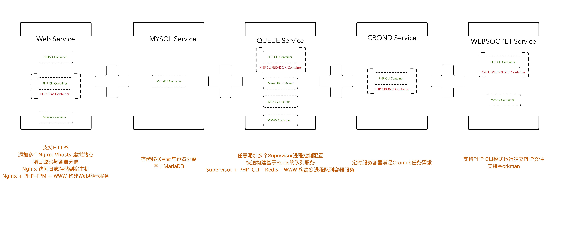

# LNMP Docker - 在国内快速构建LNMP容器环境

3分钟构建开发、测试、生产L(Alpine Linux ) + N(Nginx) + M(MariaDB) + P(PHP) Docker 容器应用环境，升级信息[参考](https://github.com/bravist/lnmp-docker/releases )。




## 主要特性

+ 基于PHP 7.1版本，构建干净、轻量级PHP依赖环境。
+ 基于[Alpine Linux](https://alpinelinux.org/) 最小化Linux环境加速构建镜像。 使用 [阿里巴巴开源镜像站](https://opsx.alibaba.com/mirror) 在国内3分钟完成整个镜像构建。
+ 内置PHP Composer，支持PHP CLI/FPM两种运行模式。PHP CLI 适用于命令行、后台PHP服务。PHP FPM基于CLI基础镜像，独立安装FPM模块。Nginx容器与PHP-FPM采用Socket方式连接，提供PHP Web应用环境。
+ 提供PHP CLI模式独立运行模式参考：`call-websockt` 与 `php-superviosr`。`call-websockt` 是基于[workman](http://www.workerman.net/) 的PHP Socket服务。`php-supervior` 实现基于Supervisor的队列服务。
+ 可独立配置容器运行时环境参数，支持容器运行日志、数据与宿主机分离，方便调试与维护。
+ 支持Nginx虚拟站点、SSL证书服务。配置参考Nginx中`cert`与`conf.d`目录文件。
+ 支持多个虚拟站点内部程序互通。
+ 使用Docker Compose 编排容器，支持在开发、测试、生产环境中快速完成服务器搭建任务。


## 安装Docker与Docker Compose

本项目基于CentOS 7构建，安装Docker环境参考[官网](https://docs.docker.com/install/linux/docker-ce/centos/)。国内环境，推荐使用[阿里云Docker Hub加速器](https://cr.console.aliyun.com/#/accelerator)服务。

```bash
$ sudo mkdir -p /etc/docker
$ sudo tee /etc/docker/daemon.json <<-'EOF'
{
  "registry-mirrors": ["https://muehonsf.mirror.aliyuncs.com"]
}
EOF
$ sudo systemctl daemon-reload
$ sudo systemctl restart docker
```

推荐[Github官网](https://github.com/docker/compose/releases)安装Docker Compose。

```bash
$ curl -L https://github.com/docker/compose/releases/download/1.13.0/docker-compose-`uname -s`-`uname -m` > /usr/local/bin/docker-compose

$ chmod +x /usr/local/bin/docker-compose
```

## 安装LNMP Docker

1. 克隆Git仓库。需要提前安装好Git。

   ```shell
   $ git clone https://github.com/bravist/lnmp-docker && cd lnmp-docker
   ```


2. 配置.env环境参数，一般无需修改默认参数。配置`PHP_FPM_DOMAIN` 支持Nginx容器虚拟主机互通，配置`SUPERVISOR_DOMAIN` 支持Supervisor容器项目互通。[参考这里](https://github.com/laradock/laradock/issues/435)了解容器多个项目内部通信机制。

```shell
# 生成.env文件
$ cp .env.example .env
```

3. [*] 配置定时任务容器环境参数。默认无定时任务，可以参考`php-crond/crontabs/default.example`开启定时任务。

```shell
   $ cd php-crond/crontabs/
   $ cp default.example default
```
4. [*] 配置Supervisor后台进程处理任务。默认无后台进程处理，参考`php-supervisor/supervisor/default.conf.example` 配置多进程任务。

   ```shell
   $ cd php-supervisor/supervisor
   $ cp default.conf.example default.conf
   ```

5. 配置Nginx虚拟站点。参考`nginx/conf.d` 目录下配置，复制一份新的站点配置文件，修改域名与主机目录。

     ```shell
     $ cd nginx/conf.d
     $ cp default.conf a.com.conf
     $ vi a.com.conf

     server {
         listen  80;

         server_name  a.com;
         root   /usr/share/nginx/html/a.com;
         index  index.html index.htm index.php;

         #access_log  /var/log/nginx/log/host.access.log  main;

         location / {
             try_files $uri $uri/ /index.php$is_args$query_string;
         }

         error_page  404              /404.html;

         # redirect server error pages to the static page /50x.html

         error_page   500 502 503 504  /50x.html;
         location = /50x.html {
             root   /usr/share/nginx/html;
         }

         # pass the PHP scripts to FastCGI server listening on 127.0.0.1:9000
         location ~ \.php$ {
             fastcgi_split_path_info ^(.+\.php)(/.+)$;
             fastcgi_pass unix:/var/run/php-fpm.sock;
             fastcgi_param SCRIPT_FILENAME $document_root$fastcgi_script_name;
             fastcgi_param SCRIPT_NAME $fastcgi_script_name;
             fastcgi_index index.php;
             include fastcgi_params;
         }

         location ~ .*\.(gif|jpg|jpeg|png|bmp|swf)$
         {
             expires      30d;
         }

         location ~ .*\.(js|css)?$
         {
             expires      2h;
         }

         location ~ /.well-known {
             allow all;
         }

         location ~ /\.
         {
             deny all;
         }

         # deny access to .htaccess files, if Apache's document root
         # concurs with nginx's one
         #
         location ~ /\.ht {
             deny  all;
         }
     }

     ```

     要在本地主机上访问a.com，需要在hosts文件中添加域名指向。

6. 使用Docker Compose 快速启动容器。

     ```shell
     $ docker-compose build && docker-compose up -d
     ```

     ​

## 其他说明

项目源码通过`tianon/true` 镜像挂载了主机当前项目文件目录: `www`，推荐在改目录下新建不同子目录，然后在Nginx配置虚拟站点指向到该目录。

项目提供一份在PHP CLI模式中运行PHP应用的参考call-websocket。可以运行Workman这样的WebSocket的应用。在安装的过程中，可以忽略在`lnmp-call-websocket` 容器错误。

在安装过程中，如遇到问题，可以直接提交ISSUE反馈问题。为减少疑惑，提供一下命令做帮助。

```bash
# 查看所有运行和者退出的容器
$ docker ps -a

# 删除停止的容器
$ docker rm -f contianer_name ...

# 快速停止与删除容器组
$ docker-compose down 

# 删除本地docker镜像
$ docker rmi -f image_name ....

# 清除所有已经停止运行的容器
$ docker container prune
```
所有的容器基于Alpine Linux ，默认使用`sh` shell，进入容器时使用该命令：*docker exec -it container_name sh*

```bash
$ docker exec -it lnmp-nginx sh
```
安装 [ctop](https://github.com/bcicen/ctop) 工具可以帮助查看容器在主机的使用情况。

```bash
 $ ctop
 ctop - 15:36:35 CST      10 containers

   NAME                        CID                         CPU                         MEM                         NET RX/TX                   IO R/W                      PIDS
 ◉  lnmp-mariadb                bd3cecff945e                             0%                     179M / 7.64G        90K / 276K                  27M / 0B                    0
 ◉  lnmp-nginx                  f4452c868dcc                             0%                      8M / 7.64G         14M / 5M                    5M / 0B                     0
 ◉  lnmp-php-fpm                a68c55c28995                             0%                      72M / 7.64G        1M / 13M                    20M / 0B                    0
 ◉  lnmp-php-supervisor         15182399966b                             1%                     1.8G / 7.64G        92M / 145M                  26M / 0B                    0
 ◉  lnmp-redis                  279b2f995b2a                             0%                      8M / 7.64G         62M / 16M                   2M / 0B                     0
 ◉  lnmp-www                    09c684094c18                              -                           -             -                           -                           -  
```
